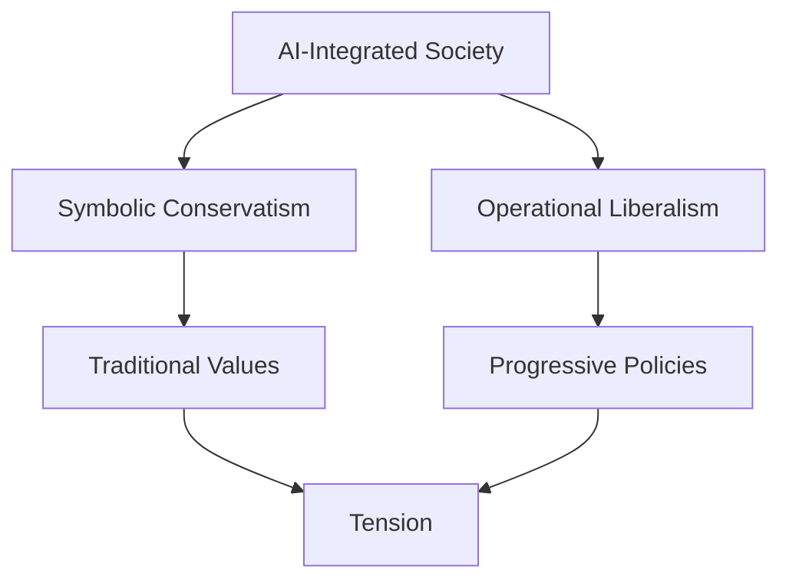

# Introduction

The concept of "symbolically conservative but operationally liberal" societies, adapted to an AI-integrated world.

[Previous: Home](00_index.md) | [Next: Symbolic Conservatism](02_symbolic_conservatism.md)
