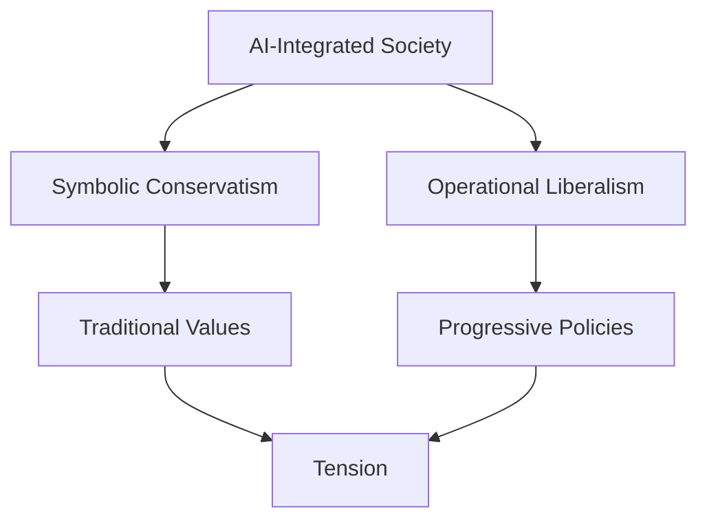

# Introduction

The concept of "symbolically conservative but operationally liberal" societies, adapted to an AI-integrated world.

[Previous: Slide Title](00_index.md) | [Next: Slide Title](next_slide.md)
