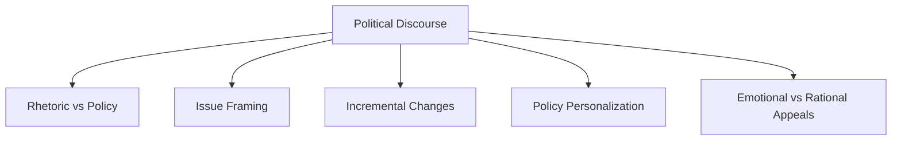

```mermaid
graph TD
    A[Political Discourse] --> B[Rhetoric vs Policy]
    A --> C[Issue Framing]
    A --> D[Incremental Changes]
    A --> E[Policy Personalization]
    A --> F[Emotional vs Rational Appeals]
```
[Previous: Paradox](04_paradox.md) | [Next: Example - Education](06_example_education.md)
