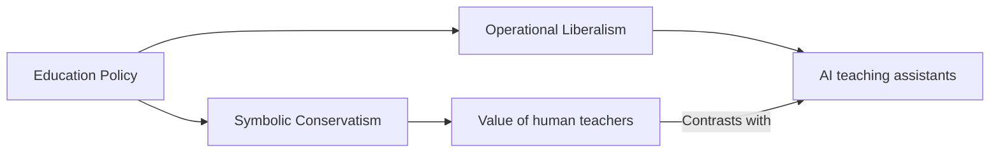

```mermaid
graph LR
    A[Education Policy] --> B[Symbolic Conservatism]
    A --> C[Operational Liberalism]
    B --> D["Value of human teachers"]
    C --> E["AI teaching assistants"]
    D -->|Contrasts with| E
```
[Previous: Political Implications](05_political_implications.md) | [Next: Example - Healthcare](07_example_healthcare.md)
