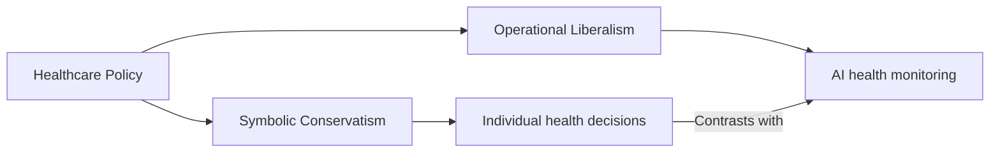

```mermaid
graph LR
    A[Healthcare Policy] --> B[Symbolic Conservatism]
    A --> C[Operational Liberalism]
    B --> D["Individual health decisions"]
    C --> E["AI health monitoring"]
    D -->|Contrasts with| E
```
[Previous: Example - Education](06_example_education.md) | [Next: Navigating Dichotomy](08_navigating_dichotomy.md)
