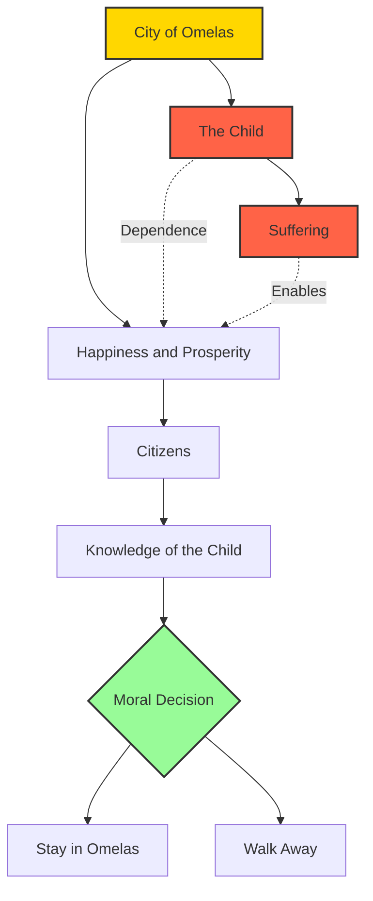

# The Ones Who Walk Away from Omelas - Diagram

```mermaid
graph TD
    A[City of Omelas] --> B[Happiness and Prosperity]
    A --> C[The Child]
    C --> D[Suffering]
    B --> E[Citizens]
    E --> F[Knowledge of the Child]
    F --> G{Moral Decision}
    G --> H[Stay in Omelas]
    G --> I[Walk Away]
    C -.-> |Dependence| B
    D -.-> |Enables| B
    
    classDef city fill:#FFD700,stroke:#333,stroke-width:2px;
    classDef suffering fill:#FF6347,stroke:#333,stroke-width:2px;
    classDef decision fill:#98FB98,stroke:#333,stroke-width:2px;
    
    class A city;
    class C,D suffering;
    class G decision;
```
